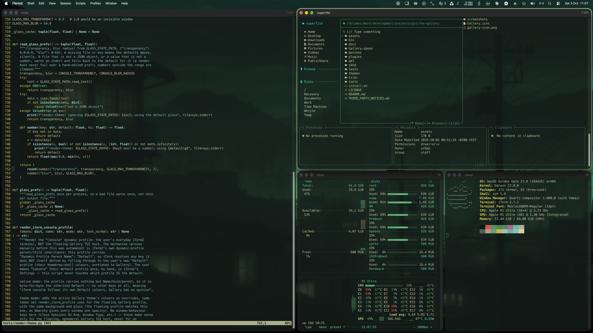
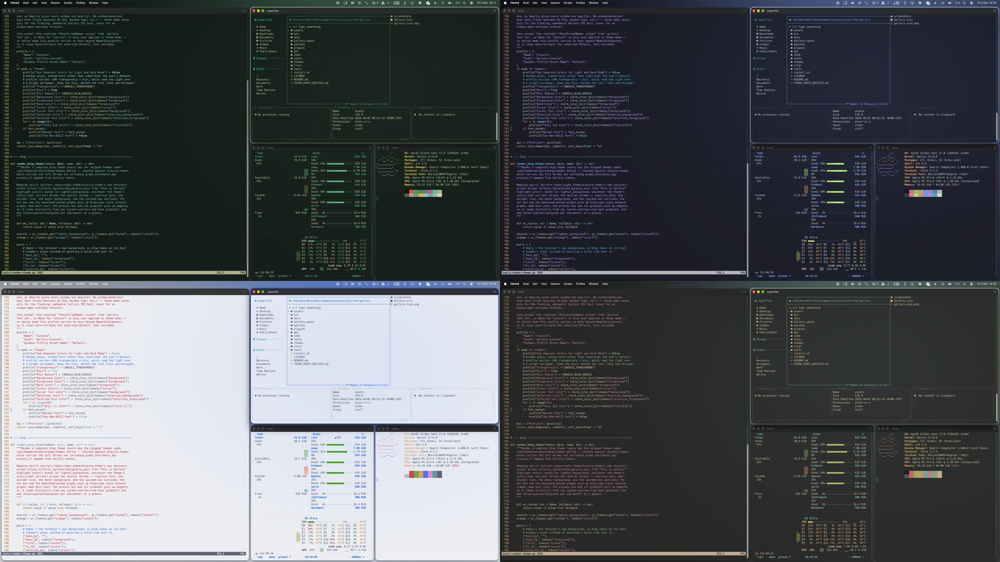
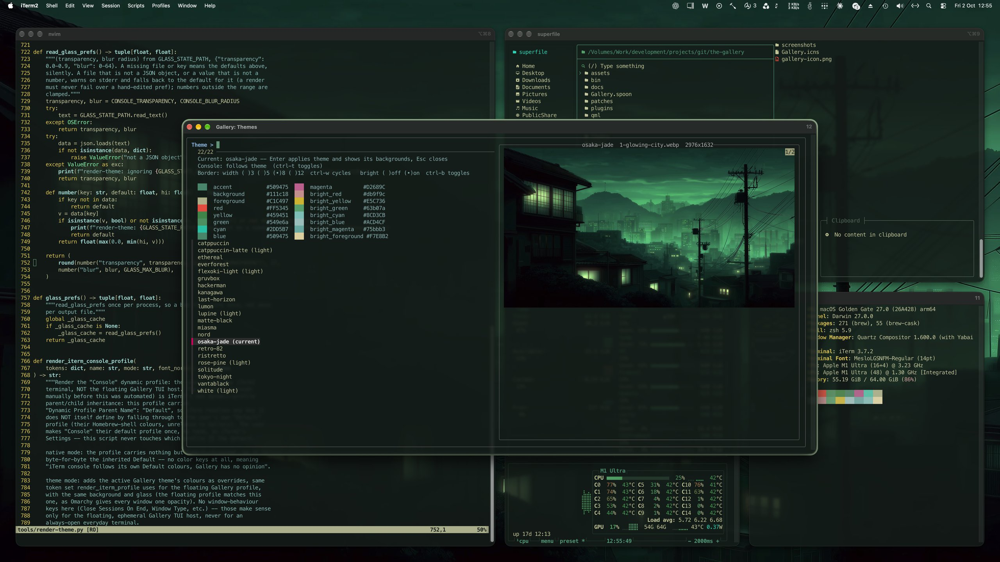
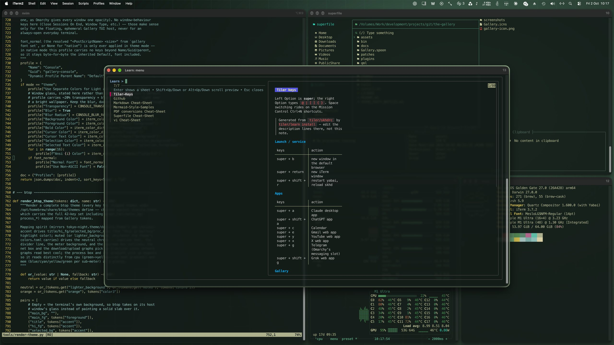
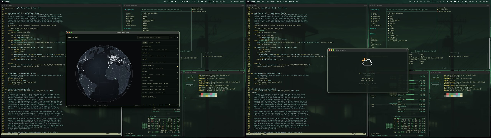
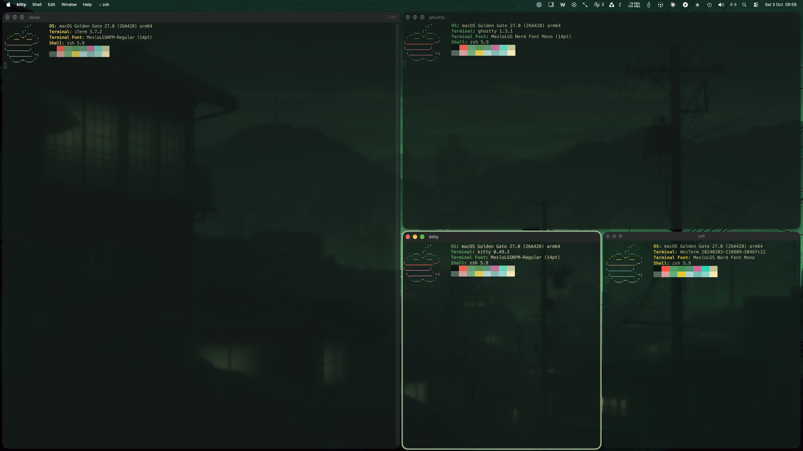

# The Gallery

An Omarchy-style desktop for macOS. Three parts, in the order they matter
day to day:

1. **Tiling.** yabai + skhd with left Option as "super", Omarchy's key
   bindings, a JankyBorders outline on the focused window, and a Learn menu
   of cheat sheets (`tiler/`).
2. **Themes.** Omarchy's colour themes rendered onto everything at once:
   your terminal (iTerm2, Ghostty, kitty or WezTerm), the focus outline,
   the wallpaper, the font.
3. **Plugins.** A Hammerspoon Spoon that hosts manifest-driven plugins
   (floating TUIs, services, unmodified Omarchy QML plugins), modelled on
   Omarchy 4's plugin system: each plugin is a directory with a
   `manifest.json`, so plugins come and go without touching Gallery itself.



## A look around

**One theme, everywhere at once.** `gallery theme set` recolours the
terminals, the focus outline, the wallpaper, btop and superfile together.
Here is the same desktop in osaka-jade, tokyo-night, catppuccin-latte and
gruvbox:



**Floating TUIs, Omarchy style.** Pickers and glance-and-dismiss tools open
as floating, centred terminals over the tiles, under the same glass. The
theme picker previews each theme's palette and wallpapers; the Learn menu
pages through cheat sheets, including one generated from the live key
bindings:





**Omarchy plugins on macOS.** Radio Atlas is an unmodified Omarchy QML
plugin, running through the Gallery's Quickshell shim; the weather panel is
a floating TUI:



**Your terminal.** iTerm2, Ghostty, kitty and WezTerm all take the theme,
the glass and the font, and follow a theme change live (see
[Terminals](#terminals)):



## The whole thing on one page

Nothing here is a daemon of its own. The Gallery is three borrowed tools
(skhd, yabai, Hammerspoon) wired together by shell scripts, a Lua Spoon,
one Python renderer and a directory of small JSON manifests. Read the map
top to bottom: keys go in at the top, pixels come out at the bottom.

```
                            ┌─────────────────────────────┐
                            │ you   (left Option = super) │
                            └──────────────┬──────────────┘
                                           │  every hotkey on the Mac goes through here
                                           ▼
            ┌───────────────────────────── skhd ──────────────────────────────┐
            │           tiler/skhdrc  ──.load──▶  skhd/gallery.skhd           │
            └───┬──────────────────────────┬──────────────────────────────┬───┘
          super+h/j/k/l               super+space              shift+ctrl+lalt+space,
      super+1..9, f, t ...                                        lalt+shift+0, ...
                │                          │                              │
                ▼                          ▼                              ▼
 ┌────────────────────────────┐  ┌──────────────────┐  ┌────────────────────────────────────┐
 │ ① TILING          tiler/   │  │ Learn            │  │ ③ PLUGINS      bin/gallery (CLI)   │
 │                            │  │                  │  │                                    │
 │ yabai       bsp tiles,     │  │ cheat sheets:    │  │ a plugin is a directory with a     │
 │             gaps, rules    │  │ markdown notes   │  │ manifest.json naming its kinds:    │
 │ JankyBorders focus outline │  │ rendered by glow │  │                                    │
 │ focus-dir   Hyprland-style │  │ in a floating,   │  │ tui, menu   floating terminal +    │
 │             neighbour pick │  │ centred terminal │  │             fzf/glow/btop, put     │
 │ rules.local app → Space    │  │ window           │  │             there by a yabai rule  │
 │             ("home")       │  └──────────────────┘  │ panel,      Hammerspoon webview    │
 │ ghosts      relaunch what  │                        │ overlay     (Gallery.spoon)        │
 │             yabai can't see│                        │ qml         PySide6 host running   │
 │ tree-guard  close a hole in│                        │             Omarchy QML unchanged  │
 │             the tree       │                        │ service,    background timers      │
 └────────────────────────────┘                        │ bar-widget  inside the Spoon       │
                                                       └────────────────────────────────────┘
                                                                          │
                                           ┌──────────────────────────────┘
                                           ▼
 ┌───────────────────────────────────────────────────────────────────────────────────────────┐
 │ ② THEMES   one theme, rendered onto everything at once  (the flow below)                  │
 │   terminal windows · focus outline · wallpaper · panel CSS · btop · superfile · widgets   │
 └───────────────────────────────────────────────────────────────────────────────────────────┘
```

Two rules keep the picture this simple:

- **skhd is the only hotkey grabber.** The Gallery never registers keys of
  its own; its bindings are one file, `skhd/gallery.skhd`, that the tiler's
  `skhdrc` includes. Every key on the map above is a line in one of those
  two files.
- **Hammerspoon is optional for most of it.** `tui` and `menu` plugins are
  pure shell + a terminal + yabai (`bin/gallery-tui`, `bin/gallery-menu`), so
  the Themes picker, System Monitor and Learn all work with the Spoon
  stopped. Only `panel`, `overlay`, `service` and `bar-widget` kinds live
  inside Hammerspoon.

### What happens when you change theme

`gallery theme set <name>` (or `theme next`, or picking one in the Themes
plugin) is the one command that touches everything. It fans out like this:

```
 gallery theme set <name>
          │
          ▼
 ~/.config/gallery/themes/current ─▶ <name>/colors.toml        Omarchy's own theme files, vendored
          │
          ▼
 render-theme.py     reads colors.toml + your prefs in state/{font,console,widgets,borders}.json
          │
          ├─▶ state/theme.css ─────────────────▶ any consumer that wants a stylesheet
          ├─▶ state/theme.json ────────────────▶ Gallery.spoon (panel / overlay variables)
          ├─▶ state/theme.sh ──────────────────▶ gallery-borders, tui plugins, your scripts
          ├─▶ iTerm2 …/gallery-theme.json ─────▶ every floating Gallery window
          ├─▶ iTerm2 …/gallery-console.json ───▶ your everyday terminal         (opt-in: gallery console)
          ├─▶ state/terminals/* ───────────────▶ the same for Ghostty, kitty, WezTerm (gallery terminal)
          ├─▶ btop theme ──────────────────────▶ System Monitor plugin
          └─▶ superfile theme (transparent) ───▶ the `spf` file manager
          │
          ▼
 hooks/theme-set.d/*      every executable, in name order, theme name as $1
     10-log-theme.sh       append a log line
     20-borders.sh         recolour the JankyBorders focus outline
     30-wallpaper.sh       put the theme's wallpaper on every Space
          │
          ▼
 Gallery.spoon reloads over IPC — open panels pick up the new colours
```

`theme render` re-runs the renderer only (no hooks, no Spoon). `console`,
`font`, `widgets` and `borders` record a preference in `state/*.json` and
trigger that same render (`borders` also re-applies the outline); `bg` records
the wallpaper choice and calls the wallpaper hook directly. See
[docs/THEMES.md](docs/THEMES.md#what-re-themes-when).

### Where it all lives

`install.sh` copies the repo onto the boot volume (launchd-started tools
cannot read an external disk; see the comment in the script), so the
running system is always a copy:

| In the repo | Installed to | Job |
|---|---|---|
| `tiler/yabairc`, `tiler/skhdrc`, `tiler/learn`, `tiler/focus-dir`, `tiler/yabai-layout` | `~/.config/yabai/`, `~/.config/skhd/` | tiling, hotkeys, Learn |
| `skhd/gallery.skhd` | `~/.config/skhd/gallery.skhd` | the Gallery's own key bindings |
| `Gallery.spoon/` (`init.lua` + `lib/*.lua`) | `~/.hammerspoon/Spoons/Gallery.spoon` | plugin host: manifests, panel/overlay/service/bar-widget kinds, IPC |
| `plugins/*/manifest.json` | `~/.config/gallery/plugins/` | bundled plugins; `gallery add <git-url>` puts third-party ones beside them |
| `themes/*/colors.toml` | `~/.config/gallery/themes/` | vendored Omarchy themes (+ any you drop in by hand) |
| `tools/render-theme.py` | `~/.config/gallery/bin/render-theme.py` | the one renderer in the flow above |
| `tools/hooks/*.sh` | `~/.config/gallery/hooks/theme-set.d/` | theme-set hooks; add your own beside them |
| `qml/` (`host.py`, `shim/`, `vendor/`) | `~/.config/gallery/qml/` | PySide6 host + a Quickshell shim so Omarchy QML plugins run unmodified |
| `patches/<plugin-id>/` | `~/.config/gallery/patches/` | macOS overrides laid over imported Linux plugins on every install/update |
| `bin/gallery`, `gallery-tui`, `gallery-menu`, `gallery-qml`, `gallery-borders`, `gallery-agent`, `gallery-hs` | `~/bin/` | the CLI and the helpers it shells out to |
| — | `~/.config/gallery/state/` | generated: rendered theme files + your `*.json` preferences |
| — | `~/.config/gallery/gallery.json` | which plugins are enabled |
| — | `~/.config/gallery/feed/<id>.json` | `bar-widget` output, for Übersicht or anything else to read |

Everything in the left column is re-created by `./install.sh`, so `git
pull && ./install.sh` is the whole upgrade path. What is *yours* — the
`state/` prefs, `gallery.json`, `ghosts.conf`, the `themes/current` link,
themes you dropped in by hand, and plugins added with `gallery add` — is
left alone by the installer.

## What it is

- `tiler/` — yabai + skhd tiling and hotkeys (left Option as "super"),
  JankyBorders, and the Learn cheat-sheet menu. See `tiler/README.md`.
- `themes/` — vendored Omarchy colour themes (see `themes/UPSTREAM.md`) plus
  `tools/render-theme.py`, which renders the active theme into CSS, JSON, an
  iTerm2 profile (plus theme files for Ghostty, kitty and WezTerm), and a
  shell fragment.
- `Gallery.spoon` — the Hammerspoon Spoon that loads plugin manifests and
  manages plugin windows.
- `plugins/` — bundled plugins, each a self-contained directory.
- `bin/gallery` — a CLI for controlling Gallery from the shell.

## Install

### Prerequisites

Have these in place on a new Mac before running the installer:

| Prerequisite | How | Why |
|---|---|---|
| **Homebrew** | [brew.sh](https://brew.sh) | the installer brews everything else; it stops up front if `brew` is missing |
| A terminal: iTerm2, Ghostty, kitty or WezTerm | `brew install --cask iterm2` (or `ghostty`, `kitty`, `wezterm`) | every floating TUI window, Learn, `super+return` and the agent window; see Terminals |
| Hammerspoon | `brew install --cask hammerspoon` | the plugin host (the installer refuses to run without Hammerspoon.app) |
| *Optional:* a folder of markdown sheets | — | the Learn menu reads them; Obsidian is not required (see Learn) |
| *Optional:* chafa, uv | `brew install chafa uv` | picker previews; the venv for the `qml` kind |

The stock `/bin/bash` 3.2 is enough.

### Running it

```sh
./install.sh
```

This copies the Spoon and bundled plugins onto the boot volume (see the
rationale comment in `install.sh` for why they are copied rather than
symlinked) and wires `~/.hammerspoon/init.lua` to load Gallery. It also
installs yabai, skhd, JankyBorders, fzf and glow, plus the companion apps
btop (the System Monitor plugin) and superfile (a themed `spf` file manager)
unless run with `--minimal`, renders the current theme, and starts
Hammerspoon. macOS then asks for Accessibility (Hammerspoon, yabai, skhd)
and a few Automation grants by hand; `gallery doctor` lists what is still
missing. Updating later is `git pull` followed by the same `./install.sh`.

The installer does not overwrite anything of yours without keeping it: a file
it replaces is moved to `<name>.gallery-bak` first, a file it edits in place
(such as `init.lua`) is copied there once before the first edit, and
everything it writes is listed in `~/.config/gallery/state/install-manifest.tsv`.
`./install.sh --dry-run` says what it would back up. To remove the Gallery and
put the Mac back as it was:

```sh
./install.sh --uninstall          # restores backups, removes what it installed
./install.sh --uninstall --purge  # ... and deletes ~/.config/gallery too
```

`--keep-wallpaper` skips the wallpaper restore (`gallery bg restore` does it
on its own). The Homebrew formulae stay. Details are in
[docs/INSTALL.md](docs/INSTALL.md#uninstalling).

[docs/INSTALL.md](docs/INSTALL.md) is the full walkthrough: flags, the order
of the permission grants, verification and troubleshooting.

## Tiling and hotkeys

`install.sh` installs the tiler first (yabai, skhd, JankyBorders, Learn) via
`tiler/install.sh`, then copies the Gallery's own key bindings into place.
skhd is the only hotkey grabber on the system: Gallery bindings live in
`skhd/gallery.skhd`, included by `tiler/skhdrc` with `.load "gallery.skhd"`,
so the Gallery never registers its own hotkeys. Pass `--skip-tiler` to
`install.sh` to skip the tiler step (e.g. on a machine that should run only
the plugin host and theming). See `tiler/README.md` for the full key table,
Learn, and the once-per-machine manual steps (Accessibility, Mission Control
shortcuts, Secure Keyboard Entry).

## Terminals

Every terminal window the Gallery opens (floating TUIs, Learn, `super+return`,
the coding agent) is opened by one script, `bin/gallery-term`, in whichever of
iTerm2, Ghostty, kitty or WezTerm is configured. With nothing configured it
uses iTerm2 if installed, else the first installed of Ghostty, kitty, WezTerm.

```sh
gallery terminal            # which one, and whether it is installed
gallery terminal list       # supported terminals: installed? current?
gallery terminal set kitty  # record it (state/terminal.json) and re-render the theme
```

Floating Gallery windows always get the Gallery theme; tiled windows
(`super+return`, the agent) use your own config. How each terminal does it:

| | floating window theme | title (for yabai) | theme change in running windows | `gallery console theme` |
|---|---|---|---|---|
| iTerm2 | the "Gallery" dynamic profile | set by the command | dynamic profiles reload themselves | the "Console" profile (set as default once, see below) |
| Ghostty | palette set by escape sequences in that window (opacity and blur are yours) | set by a wrapper | `reload_config` over AppleScript, if running | one `config-file = ?...` line in `~/.config/ghostty/config` |
| kitty | `--config` with the rendered `kitty.conf` | `--title` | kitty re-reads the changed include itself; `kitty @ set-colors` too, if remote control is on | one `include ...` line in `~/.config/kitty/kitty.conf` |
| WezTerm | `--config` glass plus escape-sequence palette | set by a wrapper | automatic (the module is on wezterm's reload watch list) | two Lua lines in your `wezterm.lua` |

The renderer writes `ghostty.conf`, `kitty.conf` and `wezterm.lua` into
`~/.config/gallery/state/terminals/` on every render, whatever terminal is
configured. `console theme` adds exactly one marked include line to the config
of Ghostty or kitty (creating the file if missing, with a `.gallery-bak` copy
before the first edit of an existing one); `console native` removes it. For
WezTerm it never edits your Lua: it prints the two lines to add, and writes
`~/.wezterm.lua` with them only when you have no wezterm config at all. Running
kitty windows pick a theme change up by re-reading the changed include; with
remote control enabled in `kitty.conf` (`allow_remote_control socket-only` and
`listen_on unix:/tmp/kitty`) the renderer also pushes the colours at once.

iTerm2 and Ghostty are driven over AppleScript, so the first window raises the
Automation prompt for the caller. Alacritty is not supported yet: `gallery-term`
has one small adapter per terminal, and Alacritty's can be added the same way.

## Usage

```sh
gallery status | list [--json] | open <id> | close <id> | toggle <id> |
gallery enable <id> | disable <id> | validate <dir> |
gallery add <git-url> [--enable] [--yes] | update [id] | remove <id> [--yes] |
gallery clone <id> <new-id> |
gallery theme list | current | set <name> | render | next |
gallery bg list | current | set <file> | next | prev | apply |
gallery console status | theme | native | toggle |
gallery terminal [status] | list | set <iterm2|ghostty|kitty|wezterm> |
gallery font status | set <family> [size] [weight] | native | list |
gallery widgets status | available | theme | native | toggle |
gallery borders status | width <n> | bright on|off|toggle |
gallery home show | save [--roam A,B] [--dry-run] | apply |
gallery ghosts [list] | fix [OWNER|ID] | forget |
gallery agent [open] | inline | status | list | set <name> | dir [<path>|--clear] |
gallery reload | log | doctor | install
```

`add`, `update`, `remove`, and `clone` mirror Omarchy's `plugin` verbs:
`add` clones a plugin from git into `~/.config/gallery/plugins`, `update`
fast-forwards git-managed plugins, `remove` disables and deletes (or
archives) one, and `clone` duplicates an installed plugin under a new id.

`theme set <name>` atomically points `~/.config/gallery/themes/current` at
the named theme, re-renders it (CSS/JSON/terminal themes/shell fragment via
`tools/render-theme.py`), runs every executable in
`~/.config/gallery/hooks/theme-set.d/` with the theme name as its argument,
and asks the running Spoon to reload over IPC. `theme next` does the same
for the alphabetically next installed theme, wrapping around. `theme
render` just re-runs the renderers for the current theme, without touching
hooks or the Spoon. Themes come from `themes/` (vendored via
`tools/vendor-omarchy-themes.sh`) plus anything a user drops into
`~/.config/gallery/themes/` by hand.

`bg ...` records a per-theme wallpaper choice in
`~/.config/gallery/state/backgrounds.json` and applies it through the
`30-wallpaper.sh` hook; `bg next`/`prev` cycle the current theme's
`backgrounds/` directory. System Events only reaches the display default and
the primary Space; a Space that was ever given its own picture keeps an
override in `~/Library/Application Support/com.apple.wallpaper/Store/Index.plist`
that shadows it, so the hook then copies the new picture into every Space
entry there and restarts WallpaperAgent. `GALLERY_WALLPAPER_ALL_SPACES=0`
keeps it to the plain System Events apply.

`console ...` decides whether your everyday terminal follows the theme (see
Terminals for Ghostty, kitty and WezTerm; this paragraph is iTerm2). The
renderer writes a second dynamic profile,
`~/Library/Application Support/iTerm2/DynamicProfiles/gallery-console.json`
("Console"), declared as a child of your own "Default" profile, so it
inherits font, keys and every other setting. In `native` mode the file
carries no colour keys and Console is identical to Default; in `theme` mode
it carries the active theme's colours, and iTerm pushes the change into
already-open windows. The mode is stored in
`~/.config/gallery/state/console.json` and re-applied on every `theme
set`/`next`/`render`. Inside the theme picker, `ctrl-t` toggles it.

One-time iTerm2 setup, by hand: Settings (Cmd-,) > Profiles > select
"Console" in the profile list > "Other Actions..." > "Set as Default". The
default profile shows a star in the list; `gallery console status` prints
`default profile: Console (ok)` once it has taken. Writing the
`Default Bookmark Guid` preference from the shell is not honoured while
iTerm runs, so the CLI never tries.

`font ...` records a single Gallery-wide monospace font preference in
`~/.config/gallery/state/font.json` (`{"family", "size", "weight"}`;
missing means "native" -- no font opinion, everything inherits its host's
own default font exactly as before this feature existed). `font set
<family> [size] [weight]` validates the family against `fc-list` (size
defaults 13, weight Regular), records it, and re-renders; `font native`
clears it. The renderer resolves the family/weight to the PostScript name
iTerm2's "Normal Font" profile key wants (via `fc-list`) and adds it to
both the floating Gallery profile and the Console profile (theme mode
only), alongside `"Use Non-ASCII Font": false` so Nerd Font glyphs come
from the same face; if resolution fails it warns to stderr and renders
without a font opinion rather than crashing. `font list` shows installed
Nerd Fonts. The QML plugin host (`qml/host.py`) reads the same file and,
when a family is set and installed, puts it first in the "monospace" alias
fallback list it already resolves Omarchy's icon font from.

`widgets ...` themes an Übersicht widget set through
`~/.config/gallery/state/crystal.css`; without such a set it does nothing.
See [docs/THEMES.md](docs/THEMES.md).

`borders ...` controls the focused-window frame JankyBorders draws
(`bin/gallery-borders`). The active colour follows Omarchy's own rule: a
theme's `hyprland_active_border` in `colors.toml` if it defines one, else
`accent`, with gradients (and their angle) honoured via JankyBorders' own
`gradient(top_left=...,bottom_right=...)` syntax. Width is 1-12 (default
5); "bright" mixes every active-border colour toward the theme's
`bright_foreground` (falling back to `light_foreground`, then
`foreground`) at a fixed ratio. Both prefs live in
`~/.config/gallery/state/borders.json` and are re-applied on every theme
render. Inside the theme picker, `ctrl-w` cycles width through the presets
3/5/8/12 and `ctrl-b` toggles bright.

`agent ...` launches a coding agent in a terminal window, modelled on
Omarchy 4's `omarchy-agent`. `shift+ctrl+super+a` — Omarchy's own keys — opens
the default agent in `$HOME`, or in the directory recorded with `gallery
agent dir <path>` (per machine; `GALLERY_AGENT_DIR` overrides it, and if it
is unreachable the agent starts in `$HOME` rather than not at all). Omarchy
starts in `$HOME/Work` because an agent will not remember a trust decision
for `$HOME`: pointing it at one directory holding every repo means one
approval instead of one per session. Like Omarchy, each agent is started with
its own spelling of
"do not stop to ask" — `claude --permission-mode bypassPermissions`, `gemini
--yolo`, `opencode --auto`, and so on — because a keypress-launched agent that
waits for an approval it cannot show is useless. That is a deliberate posture:
the agent has full file and shell access, unattended, in that directory.
`gallery agent set <name>` records the default in
`state/agent.json` (`gallery agent list` shows which are installed), and
`inline` runs it in the current terminal instead of a new window.

The window is an **ordinary terminal window, tiled like any other** — not a
floating Gallery surface. Omarchy's launcher ends in `omarchy-launch-tui
--app-id=org.omarchy.agent`, and that script is only `xdg-terminal-exec -e
<command>`: the app-id exists so rules and themes *can* single the agent out,
but nothing floats it, so Hyprland tiles it. Floating and centred is right for
btop and the Learn sheets, which are glanced at and dismissed, and wrong for a
window that is worked in for an hour beside an editor. As in Omarchy, every
press opens another agent rather than focusing the first: one per repo, one
per task. (It shipped for one day as a floating `tui` plugin; that was the
house convention applied past the point where it fitted.) The window runs a
login shell, because the terminal inherits launchd's `PATH`, which has neither
Homebrew nor the node prefixes — and therefore no `claude` — on it.

`ghosts ...` deals with windows the tiler cannot see. A window created while
the screen is locked -- usually an app's own updater quitting and relaunching
it overnight -- gets no accessibility reference: yabai never sees it, cannot
tile it, and macOS parks it at window layer -1 under every tile, where it
shows only as ghost text through the terminal glass. Nothing gives such a
window AX afterwards; the cure is a fresh one, i.e. relaunching the app. The
`gallery.ghosts` service plugin compares the window server's on-screen list
(via JXA, no extra grants) with yabai's every 30 s -- never while the screen
is locked, since acting behind the lock is what makes ghosts -- and fixes
what it finds without a word: the owning app is quit gracefully (its own
unsaved-changes sheet still protects you; an app that declines is left
alone) and reopened. Apps in `NO_RELAUNCH` (terminals, VM hosts, calls) are
never restarted unasked, because the restart is the damage; those, and an
app that refused to quit, get one silent notification banner -- the only
two cases that need a human (`ANNOUNCE` 0 never, 1 banner, 2 banner and a
spoken line through an optional `~/bin/tts-say`). The opposite failure is caught too: an "orphan" is a window
yabai sees but that has lost its node in the Space's tree (it reports
`split-type` none while its neighbours report a split) and sits unmanaged on
top of another tile; the watcher re-inserts it by toggling float twice.
`gallery ghosts` lists them, `fix` relaunches or retiles on request.
Overrides live in `~/.config/gallery/ghosts.conf`; the log is
`~/Library/Logs/gallery-ghosts.log`.

Run `gallery` with no arguments, or see `bin/gallery`, for the full verb
list.

## Documentation

- [docs/INSTALL.md](docs/INSTALL.md): step-by-step setup on a new Mac,
  installer flags, permissions in order, verification, updating and
  uninstalling, troubleshooting.
- [docs/PLUGINS.md](docs/PLUGINS.md): writing a plugin: manifest fields, the
  kinds, the `window.gallery` bridge, enabled state, Spoon IPC, importing
  Omarchy plugins.
- [docs/THEMES.md](docs/THEMES.md): writing a theme, derived tokens, every file
  the renderer writes, theme-set hooks, wallpapers, what re-themes when.
- [tiler/README.md](tiler/README.md): the tiling layer, key table and Learn.
- [qml/README.md](qml/README.md): the QML host and its Quickshell shim.
- [patches/README.md](patches/README.md): macOS overrides for imported plugins.

## Licence

MIT; see `LICENSE`. The Omarchy theme colours and QML components, the Radio
Atlas helper scripts under `patches/` and the Meteocons weather icons are MIT
licensed by their authors; their notices are in `THIRD_PARTY_NOTICES.md`.
